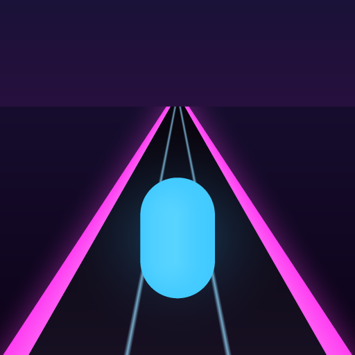

# Neon Runner

A three-lane endless runner where your own history is built into the track. Your best distance
stands on the road ahead as a gate you have to run through. Yesterday's distance stands there too, a
little closer. When you beat one, it moves.

**[Play it in your browser](https://sivagamedev.github.io/My-Mini-Game-Endless-Runner-/)** - one
click, nothing to install.



## The idea

Endless runners keep your record in a corner of the menu, as a number you glance at before the run
and forget during it. That is a waste of the only thing in the genre that is truly yours. Putting the
record on the track turns an abstract score into a finish line you can see coming, and it changes the
last ten seconds of a run from "I am still going" to "I am nearly there."

Two other decisions shape how it feels:

- **A first mistake does not end the run.** Clip something and you stumble: you lose 15% of your speed
  and your combo, but you keep running. A second clip within five seconds ends it. New players get to
  find the rhythm; good players still lose runs to greed.
- **Scoring rewards nerve.** A trick is worth 10 points times your combo; passing an obstacle within
  touching distance - a close call - is worth 30 times it. The interesting line and the profitable
  line are the same line.

## Controls

| Action | Keyboard | Touch |
| --- | --- | --- |
| Change lane | Left / Right, or A / D | Swipe left or right |
| Jump | Up, W or Space | Swipe up |
| Slide | Down or S | Swipe down |
| Pause | P or Esc | The button at the top |
| Sound on/off | M | Settings |

## What is in it

Built in **PlayCanvas** with the engine's classic scripting, no external game framework.

- **Track:** procedurally generated from a seed - ramps and rooftops, gaps with floating stones, jump
  pads, crushers, lane-shifting blocks, crumbling stones, speed strips, goo, tunnels and sky platforms.
- **Day-1 hooks:** record gates on the track, three daily missions, a day streak, and a crash screen
  that names the single nearest thing you did not quite do.
- **Metagame:** levels and XP, 26 trophies in three tiers, a shop of power-up upgrades and cosmetics,
  and nine colour zones, four of which unlock by level or distance.
- **Challenge links:** track generation is deterministic from its seed, so a run can be shared as a
  link that gives someone else the identical track and a gate at your distance. No server involved -
  the seed is the whole payload.
- **Menus in the scene:** the home screen, shop, profile and settings are built from PlayCanvas UI
  entities rather than HTML over the canvas, so they scale with the game and work on a phone.

Everything is kept on the device. There are no accounts and no backend.

## Repository layout

```
scripts/          the game's scripts, one file per PlayCanvas script asset - start here
tests/            Node unit tests, a DOM preview harness, and the icon generator
Build/            the built, playable game (what GitHub Pages serves)
files/            the full PlayCanvas project export, assets and all
Source_Code.zip   the same project as a single archive
index.html        sends the Pages root to Build/
```

To read the code, open [`scripts/`](scripts). The same files also sit inside `files/assets/<id>/`,
which is how the PlayCanvas export stores them - readable, but not worth browsing.

A tour of the interesting ones:

| File | What it does |
| --- | --- |
| `gameManager.js` | State machine, score, the HUD, pause and the crash screen |
| `spawner.js` | Seeded track generation - every obstacle type lives here |
| `runnerController.js` | Lanes, jumping, sliding, and the stumble |
| `markers.js` | The record gates on the road |
| `progress.js` | The saved profile: missions, streak, coins, stats |
| `uiKit.js` / `uiScreens.js` / `uiPages.js` | The in-scene menus |
| `challenge.js` | Shareable seeds |

## Running it

The game runs from the PlayCanvas Editor, or from `Build/index.html` over any static server. The
parts that run without the engine:

```bash
node tests/progress-test.js        # and the other *-test.js files
node tests/serve.js                # preview harness on http://localhost:5178
node tests/make-icon.js icon.png 512
```

## How it was built

Most of the code was written by Claude driving the PlayCanvas Editor directly over MCP - creating
entities, uploading scripts, launching the game, screenshotting it, reading its console and
committing checkpoints - with me designing, playing and reviewing. That setup made a few things
possible that ordinary AI-assisted coding does not: a bot that plays the game to exercise mechanics,
verification by screenshot and log rather than by assertion, and an offline proof that the seeded
track generator is deterministic before the challenge-link feature was trusted.

It also got things wrong. The "more dynamic" camera it produced felt awful while switching lanes and
stopped following the player onto rooftops; that was reverted by hand. Every decision about how the
game feels - stumble instead of death, the record gate, no paid continues - came from playing it.

## Credits

- **Engine:** [PlayCanvas](https://playcanvas.com/), MIT licensed.
- **Font:** Playpen Sans, under the [SIL Open Font License 1.1](https://openfontlicense.org/).
- **GitHub mark** on the home screen is a trademark of GitHub, Inc., used to link to this repository.

## Licence

The game's own source is MIT licensed - see [LICENSE](LICENSE). Third-party material above keeps its
own terms.
